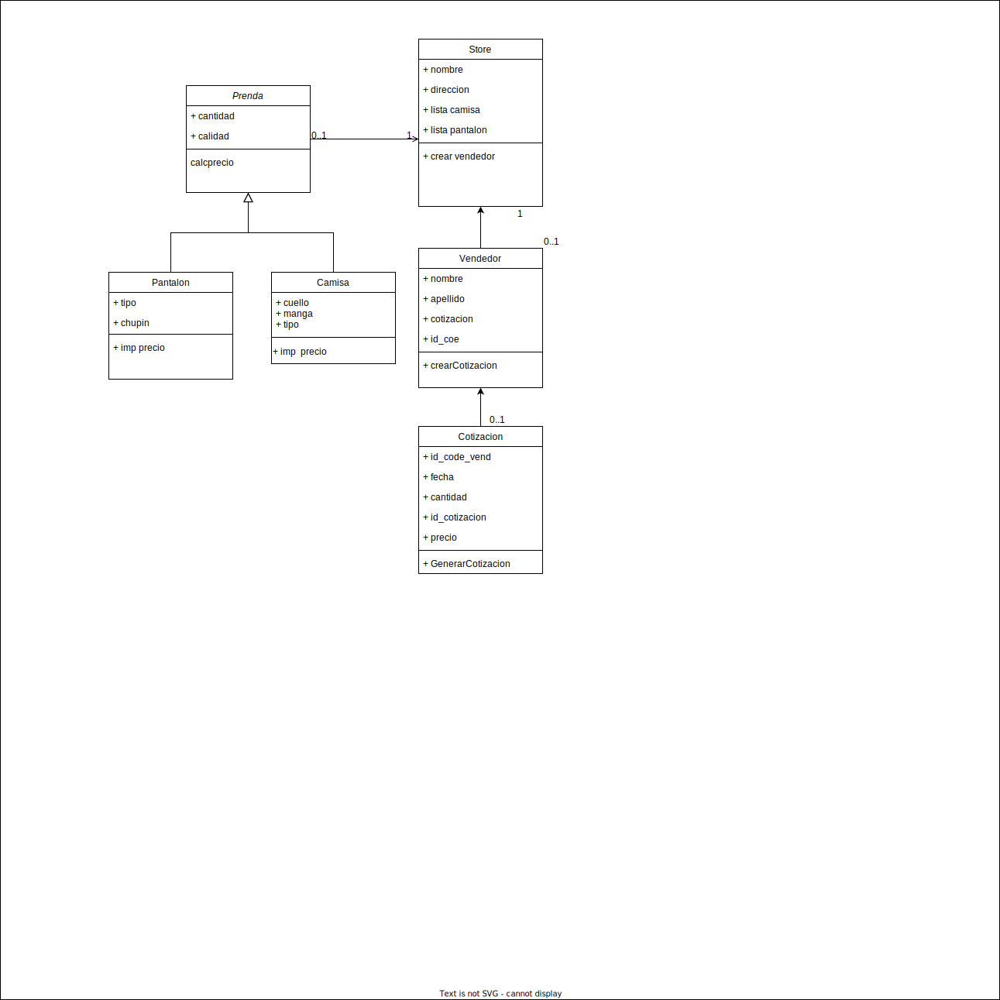

# Abstract

This is the final project of Quark's academy course in c#, which is an academy for the development of video games. In this project, mvc architecture was applied.
## Table of contents

- Requirements
- Configuration
- Diagram Class
- Example
- Develop

## Requirements

This module requires the following modules:

- [MySql](https://zetcode.com/csharp/mysql/)

## Configuration

1. Install module of Mysql.
1. Create database with name cotizacion.
1. Lauch to server.
1. It is ok, to play.

## Diagram Class

# Example

View of proyect

View of click historial

   ## Develop

- Breyner Ocampo C. - [github](https://github.com/BROC95)
